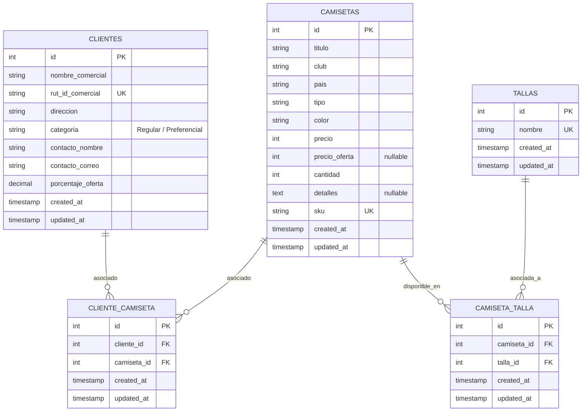

# 👕 TodoCamisetas API

[](https://laravel.com)
[](https://www.php.net)
[](https://www.docker.com)
[](https://www.mysql.com)
[](https://nginx.org)

API RESTful empresarial desarrollada en Laravel para la **gestión de inventario y ventas B2B** de TodoCamisetas. Esta solución permite la administración centralizada de camisetas, clientes B2B (categorizados para la asignación dinámica de precios) y tallas, garantizando cotizaciones y consultas personalizadas en tiempo real.

---

## 📐 Arquitectura de Datos (Modelo Entidad-Relación)

A continuación se muestra el esquema de base de datos que soporta la relación de muchos a muchos entre camisetas, tallas y clientes B2B:



---

## 🎯 Diagrama de Casos de Uso

El flujo de interacción del sistema se divide en operaciones de administración de catálogo y consultas de clientes B2B:

```mermaid
graph TD
    %% Actors
    Admin[Administrador de TodoCamisetas]
    Client[Cliente B2B]

    %% Use Cases
    subgraph Gestion_Inventario ["Gestión de Inventario (Camisetas y Tallas)"]
        UC1(Crear/Editar/Eliminar Camisetas)
        UC2(Crear/Editar/Eliminar Tallas)
        UC3(Asociar Tallas a Camisetas)
        UC4(Consultar Stock Global)
    end

    subgraph Gestion_B2B ["Gestión B2B y Clientes"]
        UC5(Registrar/Modificar Clientes B2B)
        UC6(Asignar Categoría y Descuento Personalizado)
        UC7(Asociar Catálogo de Camisetas a Cliente)
    end

    subgraph Consultas_B2B ["Consultas y Precios Dinámicos"]
        UC8(Listar Catálogo General)
        UC9(Listar Catálogo con Precios Dinámicos)
        UC10(Consultar Catálogo Específico de Cliente)
    end

    %% Relationships
    Admin --> UC1
    Admin --> UC2
    Admin --> UC3
    Admin --> UC4
    Admin --> UC5
    Admin --> UC6
    Admin --> UC7

    Client --> UC8
    Client --> UC9
    Client --> UC10
```



---

## 💼 Reglas de Negocio: Cálculo de Precios B2B

El núcleo del negocio de TodoCamisetas radica en ofrecer precios dinámicos según el tipo de cliente B2B que consulte:

1. **Clientes Regulares:**
   * Pagan siempre el **precio base** (`precio`) establecido para la camiseta.
2. **Clientes Preferenciales:**
   * Si la camiseta tiene un precio de oferta activo (`precio_oferta` no es nulo), se aplica este precio prioritariamente.
   * Si la camiseta **no** tiene un precio de oferta (`precio_oferta` nulo) pero el cliente tiene configurado un porcentaje de oferta (`porcentaje_oferta` > 0), se calcula el precio aplicando dicho descuento sobre el precio base:
     $$\text{Precio Final} = \text{Precio Base} \times \left(1 - \frac{\text{Porcentaje Oferta}}{100}\right)$$
   * En cualquier otro caso, pagan el precio base (`precio`).

---

## 🛠️ Requisitos Previos

* [Docker](https://www.docker.com/) y [Docker Compose](https://docs.docker.com/compose/) instalados y ejecutándose en tu equipo.

---

## 🐋 Estructura de Contenedores

La infraestructura está automatizada mediante Docker y se compone de tres servicios:

* **`app`**: Contenedor con PHP 8.3-FPM y todas las extensiones requeridas para Laravel.
* **`web`**: Servidor Nginx (puerto local `8080`) que redirecciona las solicitudes hacia el contenedor de PHP.
* **`db`**: Motor de base de datos MySQL 8.0 expuesto localmente en el puerto `3307` para desarrollo.

---

## 🚀 Instalación y Configuración Paso a Paso

Sigue estas instrucciones para desplegar el entorno de desarrollo local:

### 1. Clonar e ingresar al directorio
```bash
git clone <url-del-repositorio>
cd TodoCamisetas/backend
```

### 2. Configurar variables de entorno
Crea una copia de la configuración base:
```bash
cp .env.example .env
```
*Asegúrate de que las variables de conexión a la base de datos coincidan con las del docker-compose:*
```env
DB_CONNECTION=mysql
DB_HOST=db
DB_PORT=3306
DB_DATABASE=TodoCamisetas
DB_USERNAME=todo_user
DB_PASSWORD=todo_pass
```

### 3. Levantar contenedores Docker
Inicia los servicios en segundo plano:
```bash
docker compose up -d
```

### 4. Instalar dependencias del proyecto
Instala los paquetes PHP de Composer:
```bash
docker compose exec app composer install
```

### 5. Generar la llave de la aplicación
```bash
docker compose exec app php artisan key:generate
```

### 6. Ejecutar migraciones y datos semilla (Seeders)
Crea las tablas y pobla la base de datos con registros iniciales de prueba:
```bash
docker compose exec app php artisan migrate --seed
```

### 7. Generar documentación de Swagger (Opcional)
```bash
docker compose exec app php artisan l5-swagger:generate
```

---

## 📖 Uso y Consumo de la API

Una vez completada la instalación, la API estará disponible en `http://localhost:8080`.

### Documentación Disponible
* **Swagger UI:** Navega a [http://localhost:8080/api/documentation](http://localhost:8080/api/documentation) para probar los endpoints interactivamente.
* **Colección de Postman:** Importa el archivo [postman_collection.json](file:///c:/Users/ngrok/Documents/02-%20Proyectos/TodoCamisetas/backend/postman_collection.json) ubicado en la raíz del proyecto para realizar pruebas de forma ágil.

---

## 🔌 Referencia de Endpoints

### 👕 Módulo de Camisetas

| Método | Endpoint | Descripción | Parámetros de Consulta (Query) | Payload de Entrada (JSON) |
| :--- | :--- | :--- | :--- | :--- |
| **GET** | `/api/camisetas` | Listar camisetas. | `cliente_id` *(opcional, calcula precios dinámicos)* | - |
| **GET** | `/api/camisetas/{id}` | Obtener detalle de una camiseta. | `cliente_id` *(opcional, calcula precios dinámicos)* | - |
| **POST** | `/api/camisetas` | Crear una nueva camiseta. | - | `{"titulo": "Local 2026", "club": "Colo Colo", "pais": "Chile", "tipo": "Local", "color": "Blanco", "precio": 45000, "cantidad": 100, "tallas": [1,2], "sku": "CC26L"}` |
| **PUT** | `/api/camisetas/{id}` | Actualizar datos de una camiseta. | - | Campos a actualizar (igual a POST) |
| **DELETE** | `/api/camisetas/{id}` | Eliminar una camiseta. | - | - |

### 👥 Módulo de Clientes B2B

| Método | Endpoint | Descripción | Payload de Entrada (JSON) |
| :--- | :--- | :--- | :--- |
| **GET** | `/api/clientes` | Listar todos los clientes registrados. | - |
| **GET** | `/api/clientes/{id}` | Obtener detalle de un cliente. | - |
| **POST** | `/api/clientes` | Crear un cliente. | `{"nombre_comercial": "Distribuidora B2B", "rut_id_comercial": "77665544-3", "direccion": "Santiago Centro", "categoria": "Preferencial", "contacto_nombre": "Carlos Perez", "contacto_correo": "carlos@b2b.com", "porcentaje_oferta": 12.5}` |
| **PUT** | `/api/clientes/{id}` | Actualizar datos de un cliente. | Campos a actualizar (igual a POST) |
| **DELETE** | `/api/clientes/{id}` | Eliminar un cliente *(Falla si tiene camisetas asociadas)*. | - |
| **GET** | `/api/clientes/{id}/camisetas` | Listar catálogo asignado a un cliente específico. | - |

### 📏 Módulo de Tallas

| Método | Endpoint | Descripción | Payload de Entrada (JSON) |
| :--- | :--- | :--- | :--- |
| **GET** | `/api/tallas` | Listar todas las tallas. | - |
| **GET** | `/api/tallas/{id}` | Obtener detalle de una talla. | - |
| **POST** | `/api/tallas` | Registrar una nueva talla. | `{"nombre": "XL"}` |
| **PUT** | `/api/tallas/{id}` | Modificar nombre de una talla. | `{"nombre": "XXL"}` |
| **DELETE** | `/api/tallas/{id}` | Eliminar una talla. | - |

---

## 🧪 Pruebas Unitarias y de Integración

El proyecto incluye tests automáticos para asegurar que los controladores, las reglas de negocio (cálculo de precios dinámicos) y las restricciones de base de datos funcionen de manera correcta.

Para ejecutar las pruebas dentro del contenedor de Docker:
```bash
docker compose exec app php artisan test
```

---

## ⏹️ Detener el Entorno

Para detener la ejecución de los contenedores Docker sin borrar los volúmenes de datos persistentes:
```bash
docker compose down
```
